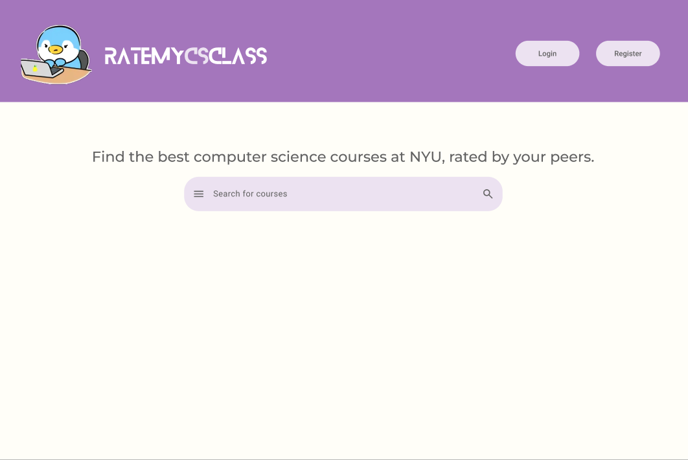
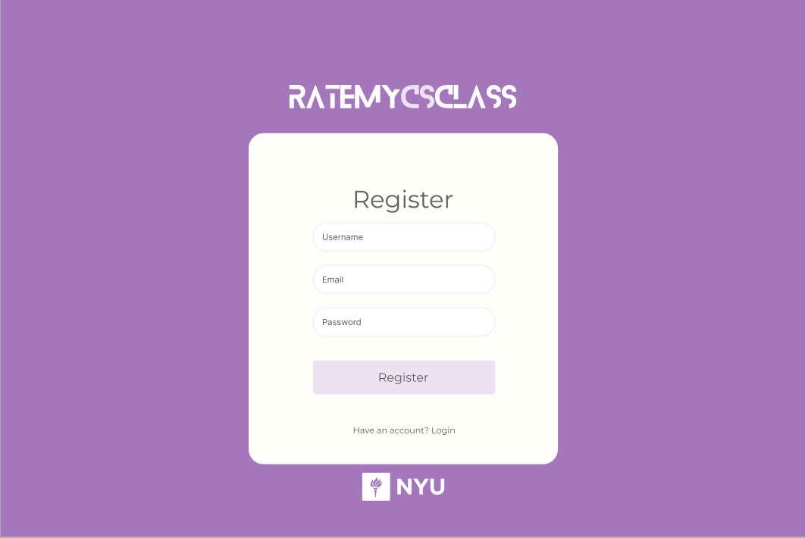
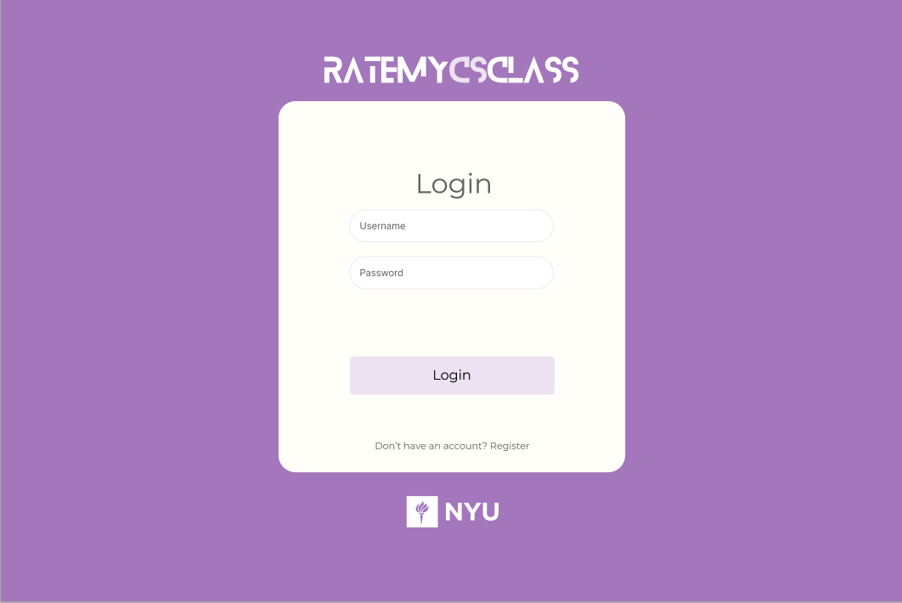
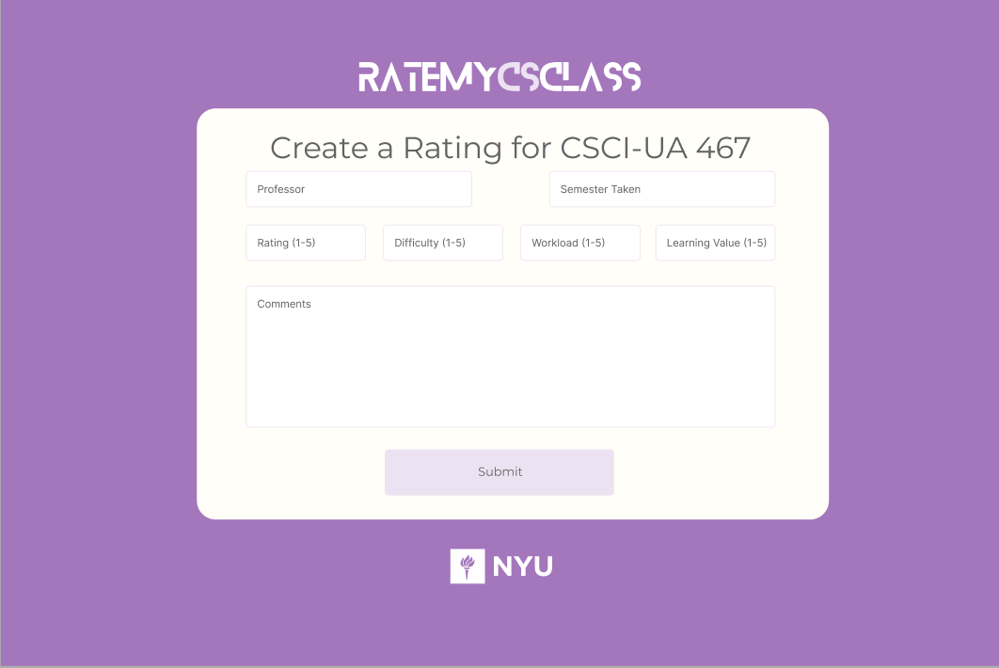
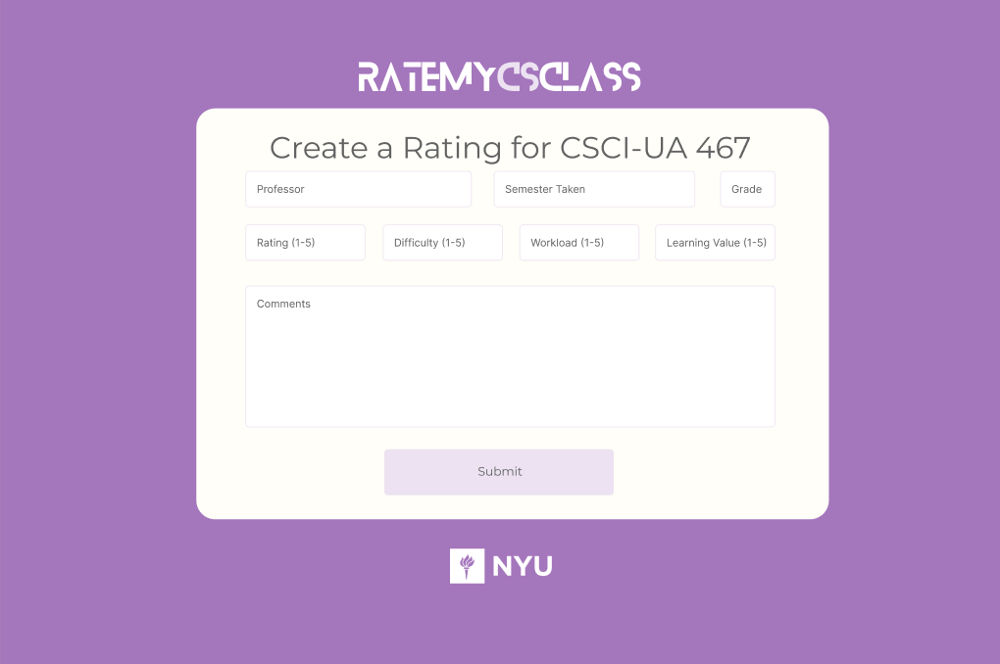
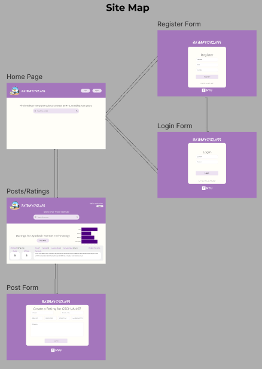

# RateMyCSClass

## Overview

RateMyCSClass is a web application designed to help NYU students make informed decisions about computer science classes by providing detailed, student-generated reviews and ratings. Unlike platforms that focus solely on professor reviews, RateMyCSClass centers on the classes themselves, offering insights into aspects like difficulty, workload, and learning value. This focus allows students to evaluate classes based on past student experiences, enabling them to choose classes that best align with their academic goals and learning preferences.

Through RateMyCSClass, students can browse a comprehensive catalog of computer science classes, view aggregate ratings, and read detailed reviews. Registered users can also contribute their own feedback, rate classes they've taken, and engage in a community of peers with similar academic interests. The platform's goal is to create a reliable resource for students navigating NYU's CS curriculum, fostering a more transparent and informed class selection process.


## Data Model

The application will store Users, Classes, and Reviews, along with a relationship between them to maintain review contributions and ratings.

* Users can submit multiple Reviews and rate multiple Classes.
* Each Class can have multiple Reviews associated with it.
* Each Review includes a reference to the Class and User who submitted it.

An Example User:

```javascript
{
  username: "savinachan",
  email: "sc8881@nyu.edu",
  password: // a password hash,
  reviews: // an array of references to Review documents
}
```

An Example Class:

```javascript
{
  classCode: "CSCI-UA 467",
  title: "Applied Internet Technology",
  reviews: // an array of references to Review documents,
  averageRating: 5.0 // aggreggate rating based on submitted reviews
}
```

An Example Review:

```javascript
{
  user: // a reference to a User object,
  class: // a reference to a Class object,
  semesterTaken: "Fall 2024",
  professor: "Joe Versoza",
  rating: 5,
  difficulty: 3,
  workload: 4,
  learningValue: 5,
  grade: "A",
  comment: "This class gave a strong foundation in web development skills with practical, hands-on projects."
}
```

## [Link to Commented First Draft Schema](src/db.mjs) 

## Wireframes

/ - The home page will provide an overview of the application.



/register - The registration page will allow new users to create an account.



/login - The login page will let returning users sign in with their registered credentials.



/rating-form/slug - This page will allow logged-in users to submit a review for a specific class.



/class-rating/slug - This page displays aggregate ratings, individual reviews, and other details for a specific class.



## Site Map



## User Stories or Use Cases

1. As non-registered user, I can register a new account with the site.
2. As a user, I can log in to the site.
3. As a user, I can browse a list of all available computer science classes.
4. As a user, I can view detailed information and reviews for a specific class.
5. As a user, I can submit a new review for a class I've taken.

## Research Topics

* (6 points) React
  * Description: React is a popular JavaScript library for building user interfaces, particularly single-page applications. It enables developers to create reusable UI components, which manage their own state and can be composed to build complex interfaces.
  * Why Use It: React's component-based architecture simplifies the process of developing and maintaining large applications by breaking the UI into smaller, manageable parts. Additionally, React’s virtual DOM enhances performance by updating only the necessary parts of the UI, making the application more responsive.
  * Modules / Libraries: To implement React, I'll be using `create-react-app` to set up the development environment and streamline configuration. Additionally, I may explore `react-router` for client-side routing and `react-redux` if state management across components becomes necessary.
* (2 points) Tailwind CSS
  * Description: Tailwind CSS is a utility-first CSS framework designed to speed up styling by providing predefined utility classes that developers can apply directly to HTML elements. Rather than writing custom CSS rules, developers use classes like `bg-blue-500` or `text-center` to apply styles instantly.
  * Why Use It: Tailwind CSS offers flexibility and customization without the need to override styles, unlike traditional CSS frameworks. Its utility-first approach allows developers to rapidly build responsive, consistent UIs with less code and helps maintain design consistency throughout the application.
  * Implementation: I’ll integrate Tailwind CSS into the project using its CLI tool to process and inject styles into the project’s `main.css`. Additionally, I’ll create custom configuration files to match the application's design requirements.
* (2 points) Chart.js
  * Description: Chart.js is a simple yet powerful JavaScript library for creating visually appealing, interactive charts and graphs. It offers various chart types, including line, bar, radar, doughnut, and more, making it versatile for data visualization.
  * Why Use It: Chart.js simplifies the process of adding dynamic data visualizations to a web app. Its minimalistic API allows developers to implement charts quickly and makes it easy to update and customize charts with new data, providing valuable insights into metrics like class difficulty or workload trends over semesters.
  * Modules / Libraries: For the project, I’ll use the `react-chartjs-2` wrapper to integrate Chart.js within the React environment. This allows Chart.js to leverage React’s component-based structure, making it easy to add interactive charts that respond to user input and update dynamically based on new data inputs.

10 points total out of 10 required points


## [Link to Initial Main Project File](src/app.mjs) 

## Annotations / References Used

1. [None Yet]() - 
